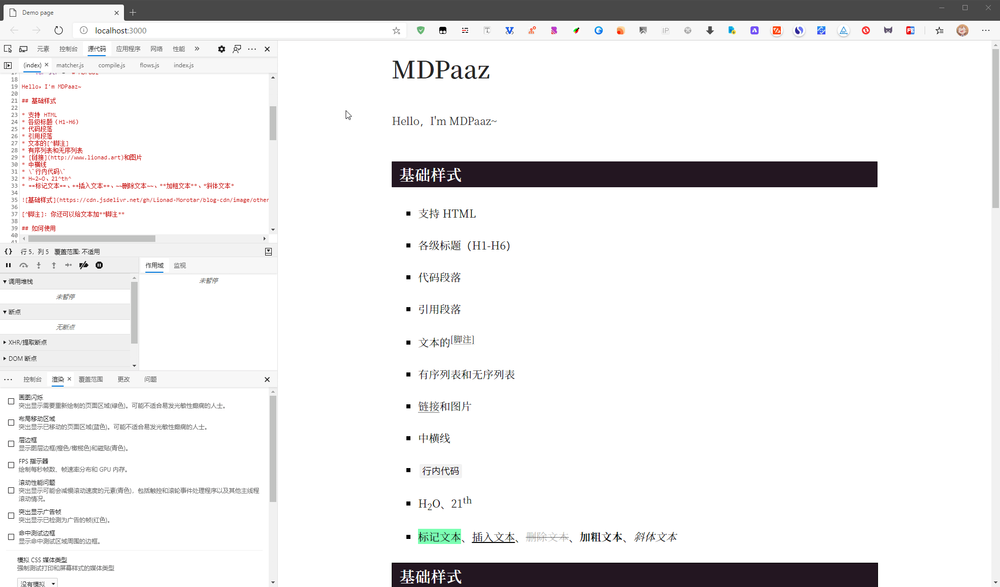

# Markdown Paaz

WIP: A simple markdown parzer which supports plugins.

## Demo Page

Demo Page：

## Refactor

去年读 VueJS 的 HTML Parser 的时候，仿照着写了一个 Markdown 解析器，叫做 TEditor。TEditor 维护了一个解析状态栈。逐个读入字符，结合当前解析状态进行状态转换，将旧状态推入栈中，以模仿解析 HTML 的层级结构。状态栈的入栈、出栈过程，通过 DIG_IN、DIG_OUT 来维护，这两个函数会触发更新标签流的副作用。

因为处理整段字符也只需要一次循环；要维护的状态大体上来说只有零散的几个变量和一个状态栈；没有用正则匹配；再加上每解析过程和正常的 Markdown 解析器不一样，TEditor 最大段落只支持到行，再加上每行都做了 LFU 缓存。所以理论上来说 TEditor 应该相当快... 不过，随着解析器的功能增强，状态维护变得有点困难，特别乱。反正我现在是很难看懂我以前写了啥玩意儿...

经过一年的 JS 学习，我的 JS 水平提高了不少。近期我重写了这个 Markdown 解析器，舍弃了“状态转换”的概念，用回了正则匹配 + AST。速度慢了，但扩展性强上不少。

Markdown 的语法上下文无关，所以可以用传统的自上而下或自下而上的语法进行解析。

如果涉及到一些 Markdown 扩展内容，比如说脚注功能，它需要解析脚注内容并在文档底部插入脚注链接，这时候，就是上下文相关语法了。

对这种上下文相关的语法，Markdown Paaz 提供了钩子函数，能将某个时刻的解析内容向外暴露。比如说，buildEnd 时，向外暴露生成的 HTML 代码。通过传入回调函数，可以对 HTML 进行一些处理，这样就可以避免解析器上下文不相关的影响了。

有空还是得学习 Markdown-It 的源码，仿制那玩意儿是我的目标...

[阅读更多](https://mgear-blogs.obs-website.cn-east-3.myhuaweicloud.com/articles/fold/2019-6/a-markdown-parser.html)